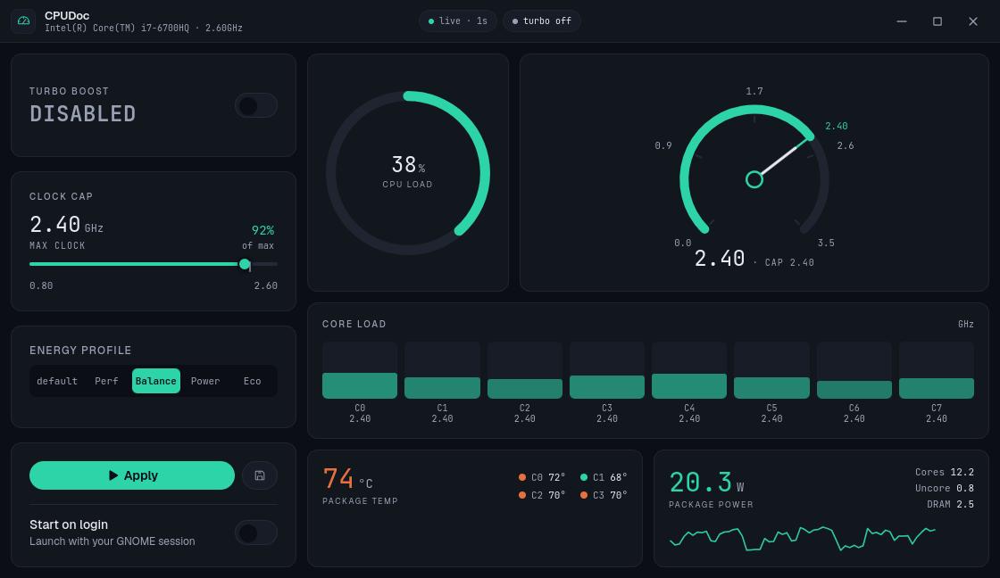

# CPUDoc

Control and monitor your Intel CPU on Linux — a dark, instrument-panel desktop app built with Tauri.

[](https://github.com/SlyHammad18/CPUDoc/releases)
[](https://github.com/SlyHammad18/CPUDoc/releases)
[](LICENSE)
[]()
[]()
[]()

## Features

- **Turbo boost toggle** — enable/disable all-core boost (`intel_pstate` `no_turbo`)
- **Clock cap slider** — cap the CPU speed via `max_perf_pct`, with a readout that snaps to the kernel-realized MHz (no guessing between 2.3 and 2.4)
- **Energy profiles** — EPP presets (Performance / Balance / Power / Eco)
- **Live telemetry** — animated CPU-load ring, frequency gauge, per-core usage + frequency bars, package & per-core temperatures, and RAPL package power with rolling sparklines
- **Start on login** — optional, off by default
- **CLI profiles** — apply a preset without opening the UI

## Screenshot



## Install

Download `CPUDoc_0.1.0_amd64.deb` from the [latest release](https://github.com/SlyHammad18/CPUDoc/releases/latest) and install it:

```bash
sudo apt install ./CPUDoc_0.1.0_amd64.deb
```

The package installs the app (`/usr/bin/cpudoc`), the polkit-authorized privilege helper, and a udev rule so RAPL power readings work without root.

For development installs (helper + polkit policy only):

```bash
sudo ./install.sh
```

## Usage

Launch CPUDoc from your app grid or run `cpudoc`. Click **Apply** to write settings — polkit asks for your password once per session.

Apply a profile from the terminal:

```bash
cpudoc --apply-profile balanced   # performance | balanced | power | eco | quiet
cpudoc --apply-profile            # applies the profile saved in the app
```

## Build from source

Requires Rust, Node.js, and Tauri's Linux dependencies (`webkit2gtk-4.1`, `gtk3`, `libsoup3`).

```bash
cd frontend && npm install
cd ../src-tauri && ../frontend/node_modules/.bin/tauri build
```

The Debian package is written to `src-tauri/target/release/bundle/deb/`.

## License

[MIT](LICENSE)
